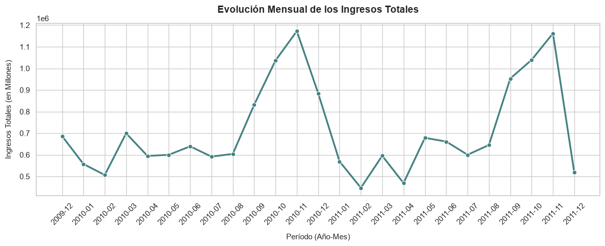
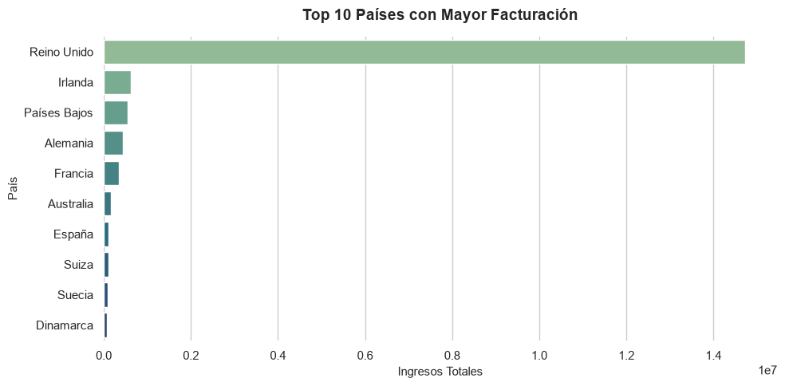
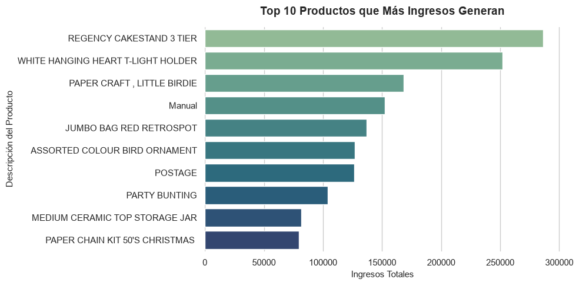
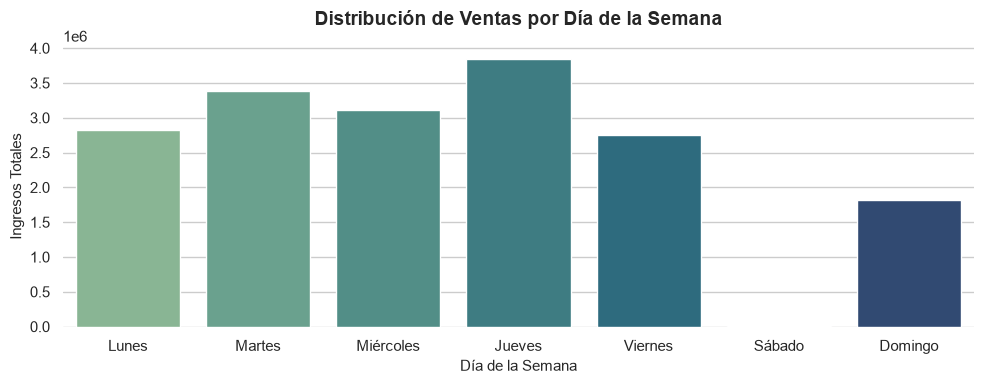
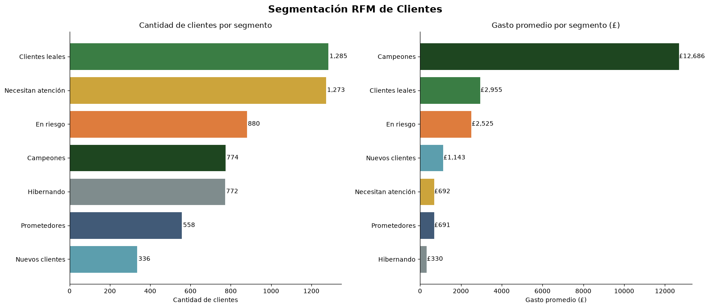

# 🛒 Análisis de Ventas E-Commerce UK — Segmentación RFM y Patrones de Comportamiento


---

## 📌 Contexto y objetivo

Este proyecto analiza el dataset **Online Retail II (UCI)**, que contiene más de 500.000 transacciones reales de una tienda online del Reino Unido entre 2010 y 2011.

El objetivo es responder tres preguntas concretas de negocio:

> **¿Cuándo y dónde se concentran los ingresos?**
> **¿Qué productos impulsan realmente la facturación?**
> **¿Qué tipo de clientes tiene la tienda y cómo retener a los más valiosos?**

---

## 🔬 Hipótesis de análisis

Estas son las hipótesis que guiaron el análisis, planteadas antes de explorar los datos y contrastadas con los resultados obtenidos.

### Hipótesis 1 — Estacionalidad de ingresos
> *"Los ingresos no se distribuyen uniformemente a lo largo del año. Se espera un pico pronunciado en el último trimestre (octubre–diciembre) asociado a la temporada navideña en el mercado británico."*
---

### Hipótesis 2 — Concentración geográfica de la facturación
> *"Aunque la tienda opera a nivel internacional, el grueso de los ingresos proviene del Reino Unido. Los países europeos cercanos (Alemania, Francia, Países Bajos) representan el segundo grupo más importante."*

---

### Hipótesis 3 — Patrón semanal de compras
> *"Las compras se concentran en días hábiles (lunes a jueves), con una caída marcada el fin de semana. Esto sugiere que una porción significativa de los compradores son empresas (B2B), no consumidores finales."*

---

### Hipótesis 4 — Segmentación desigual de clientes (Principio de Pareto)
> *"Una minoría de clientes genera la mayoría de los ingresos. Se espera que los segmentos 'Campeones' y 'Clientes leales' concentren más del 50% de la facturación total, a pesar de ser una fracción pequeña de la base de clientes."*

---

### Hipótesis 5 — Clientes recientes pero poco frecuentes como oportunidad
> *"Existe un grupo relevante de clientes con alta recencia (compraron hace poco) pero baja frecuencia (pocas compras). Son 'Nuevos' o 'Prometedores' y representan la mayor oportunidad de crecimiento con campañas de activación temprana."*

---

## 🔍 Hallazgos principales

- **Hipótesis 1 [Confirmada]:** *"El pico histórico del dataset ocurre en noviembre de 2010, alcanzando más de 1.16 millones de libras en ventas; una cifra que superó en un 67.2% al promedio mensual de ese mismo año. Este comportamiento confirma la enorme dependencia del negocio hacia la campaña de Q4 (octubre-diciembre) impulsada por las festividades de fin de año."*

- **Hipótesis 2 [Confirmada]:** *"El Reino Unido concentra el 83.0% de la facturación total global de la tienda, dejando en claro que es el motor absoluto del negocio. Irlanda ocupa el segundo puesto global con un 3.5%, seguido muy de cerca por los Países Bajos (3.1%), Alemania (2.4%) y Francia (2.0%). Ningún país fuera de este grupo europeo logra superar el umbral del 1% de participación."*

- **Hipótesis 3 CONFIRMADA**

- **Hipótesis 4 CONFIRMADA**

- **Hipótesis 5 CONFIRMADA**

- **Hipótesis 6 CONFIRMADA**


---

## 🛠️ Tecnologías utilizadas

| Herramienta | Uso |
|---|---|
| Python 3.10 | Procesamiento y análisis |
| Pandas | Manipulación y agrupación de datos |
| Matplotlib / Seaborn | Visualizaciones estáticas |
| Jupyter Notebook | Documentación del análisis |

---

## 📁 Estructura del proyecto

```
ecommerce-analisis/
├── data/                                 # Se debebe crear esta carpeta respetando la estructura de la misma para ejecutar el proyecto
│   ├── Raw/
│   │   └── online_retail_raw.xlsx        # Dataset original
│   └── Processed/
│       ├── online_retail_CLEAN.csv       # Dataset limpio (output de notebook 01)
│       └── online_retail_rfm_completo.csv # Dataset con segmentos RFM
├── images/
│   ├── distribucion_ventas_diarios.png
│   ├── evo_mensual_ingresos_totales.png
│   ├── RFM.png
│   ├── segmentacion_clientes_rfm.png
│   ├── top10_paises_mayor_recaudacion.png
│   └── top10_productos_mayor_ingreso.png
├── notebooks/
│   ├── 01_limpieza.ipynb                 # Limpieza y transformación
│   ├── 02_eda.ipynb                      # Análisis exploratorio
│   └── 03_rfm_segmentacion.ipynb        # Modelo RFM y segmentación
└── README.md
```

---

## ▶️ Cómo ejecutar el proyecto

**1. Clonar el repositorio**
```bash
git clone https://github.com/TU-USUARIO/ecommerce-analisis.git
cd ecommerce-analisis
```

**2. Instalar dependencias**
```bash
pip install pandas matplotlib seaborn openpyxl jupyter
```

**3. Descargar el dataset**

Descargá el archivo desde [Kaggle - Online Retail II](https://www.kaggle.com/datasets/mashlyn/online-retail-ii-uci) y guardalo en `data/Raw/`.

**4. Crear la carpeta Data siguiendo la guía de estructura**

```bash
Siguiendo la guía estructura del proyecto, creá la carpeta Data.
```

**5. Ejecutar los notebooks en orden**
```bash
jupyter notebook
```
`01_limpieza` → `02_eda` → `03_rfm_segmentacion`

---

## 📬 Contacto

- [Mi LinkedIn](https://www.linkedin.com/in/jerem%C3%ADas-tor%C3%A9-productdesigner/)
- [Mi portfolio](https://v0-jeremiastoredesigner.vercel.app/)

---

*Dataset público de UCI Machine Learning Repository — Online Retail II.*
